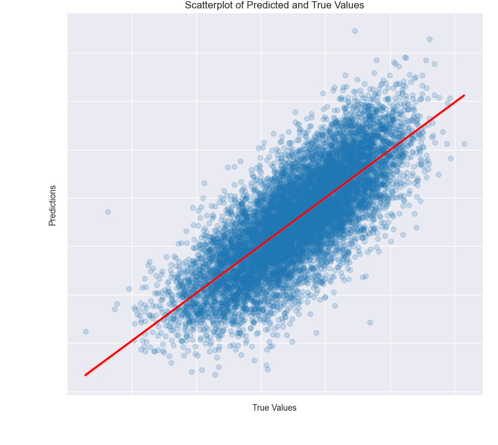

```{r setup, include=FALSE}
knitr::opts_chunk$set(echo = FALSE)

# Load dependencies 
library(reticulate) # For rendering Python code 
```

## Abstract 

<div style="text-align: justify"> *The OCED’s Programme for International Student Assessment (PISA) has consistently found that girls outperform boys in reading, among other domains, and that this gender gap is large, worldwide, and persistent throughout primary and secondary schooling. Cited literature highlights how girls’ academic strength relative to their male peers may impact their confidence and interests across subjects, thus explaining differences in girls’ career aspirations, such as a lower likelihood of joining STEM fields. While previous research has observed a selection of predictors for reading scores in single countries, this project used machine learning methods to identify the strongest predictors of reading scores from the complete 2018 PISA dataset, distinguished by gender. After fitting and validating different models, the baseline linear regression, and regression with an added ridge penalty yielded similarly good results and produced different predictors for girls and boys, which supports the value of gender-sensitive education policies.* </div>


## Problem

<div style="text-align: justify"> The OECD's Programme for International Student Assessment (PISA) has consistently found that girls outperform boys in reading, among other domains, and that this gender gap is large, worldwide, and persistent throughout primary and secondary schooling [@stoet2018gender]. Recent literature highlights how girls’ academic strength relative to their male peers may impact their confidence and interests across subjects, thus explaining differences in girls’ career aspirations, such as a lower likelihood of joining STEM fields. While previous research has observed a selection of predictors for reading scores in single countries [@dong2019exploration], the project “PISA Revisited“ examines predictors for reading scores of 15-year old boys and girls across all PISA countries, using the 2018 PISA dataset. The potential of ML techniques to analyze large-scale data and identify student scores is still underutilized, in particular with regards to gender differences. With a focus on differences between girls’ and boys’ predictors for reading achievement, this project has aimed to uncover underlying factors that may help explain the reading achievement gap. The project has served to answer the question: What predicts boys’ reading achievement and how does this differ from predictors of girls’ reading achievement?</div>


## Data and Method

<div style="text-align: justify"> 
The underlying data for this ML project was taken from the most recent 2018 iteration of the PISA, considered one the most comprehensive standardized assessments in education, and yardstick for national education strategies and education policy. The administered student questionnaire assesses the academic performance, attitudes and learning environments of 15-year olds in 79 countries around the world.  Most countries assessed between 4,000 and 8,000 students, which resulted in a data frame with a total of 612,004 observations of individual students across 1,120 columns. 

```{r fig1, eval = TRUE, echo = FALSE, out.width = "100%", fig.cap = "Overview of variables"}
knitr::include_graphics("figures/Table_variables_overview.png")
```

In order to work with the data, a random sample of 100,000 observations was taken and feature selection was conducted as a first step in line with a literature review of previous research on literacy using PISA data [@brow2019significant]. In order to retain as much of the original data, independent variables were imputed using the MissForest imputer and while categorical values were One Hot Encoded, normalization was applied on each ordinal and continuous feature, transforming it to a value between 0 and 1 with the sklearn’s MinMaxScaler.  In the MissForest model, missing values were filled in using median/mode imputation and in subsequent iterations, the missing values are predicted using the others as training rows, which are fed into a Random Forest model (stage 2 in fig. 2).  The final result yielded a dataset of 205 features with high internal validity, which were used as independent variables to predict the continuous variable reading score, with a mean of 500 points with approximately 100 points of standard deviation.  Due to a large number of observations, the project employed a reduced testing-training set split from 80% to 70% training data, 10% testing data and two validation sets with 10% of the data each (stage 3).

```{r fig2, eval = TRUE, echo = FALSE, out.width = '50%', fig.cap = "Method"}
knitr::include_graphics("figures/methodology_steps.png")
```

After preparing and splitting the data, a selection of models was trained (step 4).  A linear regression model served as the baseline for the further analysis. This model along with a ridge penalty and a ridge regression with polynomial transformed input data were firstly trained on the training data. Next, a Random Forest and an Extra Trees model with default parameters were performed. In the second stage all models were fine-tuned on the validation sets and then, the best performing model was retrained with more data and tested on the test set.  After comparing the results, in order to combine the strengths of different model approaches, the best performing linear regression model was paired with the best performing tree-based model in an ensemble. At the end, an adequate model was chosen to compute the most important predictors for boys and girls (step 5). For this purpose, the model was trained on the gender-specific data subsets of the entire data set and the coefficients of the model were interpreted. Figure 2 presents an overview of all project stages. </div>


## Results and Analysis

<div style="text-align: justify"> All models were evaluated using Root Mean Square Error (RMSE) as the metric. Figure 3 visualizes the model selection process. The baseline model scored an RMSE  of 68.52. The only improvement of that score was achieved by the ridge regression. Initially, after 10-fold cross validation, the RMSE was 69.15. In the second step, the model was fine-tuned using SciKitLearn’s GridSearchCV. The final hyperparameters found through grid search were alpha=5, fit_intercept=True and slover=‘sag’. Through these changes, the RMSE score slightly improved to 68.00.


```{r fig3, eval = TRUE, echo = FALSE, out.width = '50%', fig.cap = "Model Selection Process"}
knitr::include_graphics("figures/model_selection_process.png")
```

Neither ridge regression with polynomial transformed data nor any of the tree methods applied yielded improved scores. After fine-tuning, the RMSE score of the ridge regression with polynomial data was around 80.67. Also, the best performing Random Forest scored a few points above the baseline (72.62). The Extra Trees model (70.29) did improve the score in comparison to Random Forest but still performed worse than the linear regression model. Thus, to build an ensemble we chose the tuned ridge regression model (RMSE 68.00) and the best ExtraTrees model (RMSE 70.29). The score of the ensemble (RMSE 66.40) overperformed the baseline. 

The model choice was based on a comparison of the RMSE of all models and considerations of interpretability. Although the ensemble performed best, it could not be chosen for the subsequent feature analysis due to a lack of appropriate interpretation methods regarding feature importance. Thus, the fine-tuned ridge regression was chosen to examine the most important features for boys and girls. 

```{r fig4, eval = TRUE, echo = FALSE, out.width = '50%', fig.cap = "Selection of the final model"}
knitr::include_graphics("figures/feature_importance_venn.png")
```

Figure 4 provides an overview of the 10 most important predictors for girls and boys, including the coefficients that derived from the gender specific models (yellow numbers represent the female, green numbers the male subset). Depending on the direction of its sign, this relative score highlights the features that are most relevant for predicting the reading score, either positively or negatively. A comparison of the most important predictors for both groups shows that they vary in magnitude, but also in order of their importance. This validates our research question. On the one hand, certain teaching strategies, such as short summaries of previous lessons have a much larger coefficient for boys than for girls (30.7 vs. 20.6, not included in the top ten predictors for girls), while other factors, such as the expectation of a Bachelor’s degree, have a strong correlation with reading performance for boys (24.62), but are not included in the most important predictors for girls at all. Some predictors, on the other hand, rank similarly in order of magnitude, such as perseverance (“If I am not good at something, I would rather keep struggling to master it than move on to something I may be good at”) or the impact of grade repetition. 

The scatterplot in Fig. 5 demonstrates the model’s predictions for reading scores of individual students. While perfect alignment with the red line represents the hypothetical perfect prediction of actual scores, deviations from the red line represent a larger prediction error. Judging from the shape of the scatterplot, the model predicts values quite uniformly across for different reading scores, however, there is a slight tendency to underestimate predictions for low-performing students and a tendency of the model to overestimate the scores of high-performing students. </div>

```{r fig5, eval = TRUE, echo = FALSE, out.width = '50%', fig.cap = "Predictions for reading scores of individual students"}

```


## Conclusions
<div style="text-align: justify"> The gender differences in predictors suggest that boys and girls respond to their learning environment differently. Designing gender-specific interventions and having an increased awareness of how these factors are expected to impact reading scores differently, may be a key strategy in boosting reading scores of low performing boys in particular. 

The workflow of data preprocessing, modeling and fine tuning presented in this project can be replicated relatively easily and customized to specific subsets of the data. It could therefore serve as a blueprint for future research in certain geographical areas or comparative research between countries of the PISA sample. Since dividing the dataset by gender produces pronounced differences, it may be worthwhile to compare subsets of the data by other factors, such as high- and low-performing students or demographic variables, such as income. 

This project demonstrated an attempt at combining sophisticated machine learning approaches and algorithms with an established field of education research. While this projects’ research question and sampling strategy was intentionally global and broad, future research could be an avenue for wedding domain-specific knowledge and focused research questions with strategies from the field of causal inference. Together, these two domains hold the potential to reasonably suggest policy interventions for populations of interest. </div>


