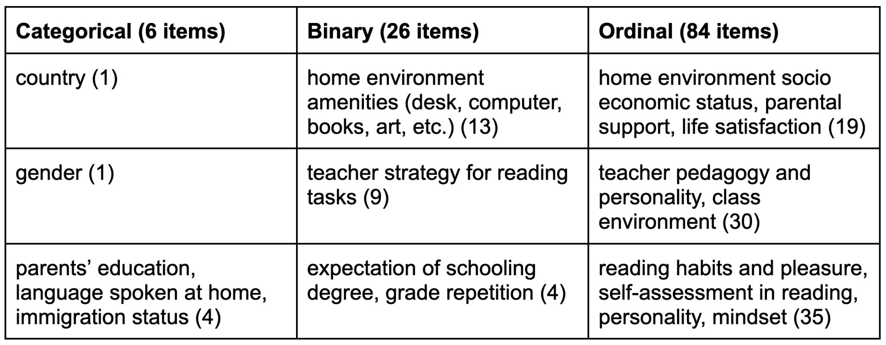

```{r setup, include=FALSE}
knitr::opts_chunk$set(echo = FALSE)

# Load dependencies 
library(reticulate) # For rendering Python code 
```

## Abstract 

The OCED’s Programme for International Student Assessment (PISA) has consistently found that girls outperform boys in reading, among other domains, and that this gender gap is large, worldwide, and persistent throughout primary and secondary schooling. Cited literature highlights how girls’ academic strength relative to their male peers may impact their confidence and interests across subjects, thus explaining differences in girls’ career aspirations, such as a lower likelihood of joining STEM fields. While previous research has observed a selection of predictors for reading scores in single countries, this project used machine learning methods to identify the strongest predictors of reading scores from the complete 2018 PISA dataset, distinguished by gender. After fitting and validating different models, the baseline linear regression, and regression with an added ridge penalty yielded similarly good results and produced different predictors for girls and boys, which supports the value of gender-sensitive education policies.

## Problem

The OECD's Programme for International Student Assessment (PISA) has consistently found that girls outperform boys in reading, among other domains, and that this gender gap is large, worldwide, and persistent throughout primary and secondary schooling. Recent literature highlights how girls’ academic strength relative to their male peers may impact their confidence and interests across subjects, thus explaining differences in girls’ career aspira- tions, such as a lower likelihood of joining STEM fields. While previous research has observed a selection of predictors for reading scores in single countries, the project “PISA Revisited“ examines predictors for reading scores of 15-year old boys and girls across all PISA countries, using the 2018 PISA dataset. The potential of ML techniques to analyze large-scale data and identify student scores is still underutilized, in particular with regards to gender differences. With a focus on differences between girls’ and boys’ predictors for reading achievement, this project has aimed to uncover underlying factors that may help explain the reading achievement gap. The project has served to answer the question: What predicts boys’ reading achievement and how does this differ from predictors of girls’ reading achievement?

## Data/Task

The underlying data for this ML project was taken from the most recent 2018 iteration of the PISA, considered one the most comprehensive standardized assessments in education, and yardstick for national education strategies and education policy. The administered student questionnaire assesses the academic performance, attitudes and learning environments of 15-year olds in 79 countries around the world.  Most countries assessed between 4,000 and 8,000 students, which resulted in a pandas data frame with a total of 612,004 observations of individual students across 1,120 columns.
In order to work with the data, a random sample of 100,000 observations was taken and feature selection was conducted in line with a literature review of previous research on literacy using PISA data. In order to retain as much of the original data, independent variables were imputed using the MissForest imputer and while categorical values were One Hot Encoded, normalization was applied on each ordinal and continuous feature, transforming it to a value between 0 and 1 with the sklearn’s MinMaxScaler.  In the MissForest model, missing values were filled in using median/mode imputation and in subsequent iterations, the missing values are predicted using the others as training rows, which are fed into a Random Forest model.
The final result yielded a dataset of 205 features with high internal validity, which were used as independent variables to predict the continuous variable reading score, with a mean of 500 points with approximately 100 points of standard deviation.  Due to a large number of observations, the project employed a reduced testing-training set split from 80% to 70% training data, 10% testing data and two validation sets with 10% of the data each.

Table 1: Overview of variables
```{r table1, eval = TRUE, echo = FALSE, out.width = '100%', fig.cap = "Model architecture"}

```


**See below for an example of how to cite related work in Markdown.**

Bidirectional Encoder Representations from Transformers (BERT) have proven successful in prior attempts to classify phrases and short texts [@devlin2018bert].

**Footnotes and Sidenotes**

You can use footnotes ^[This is a footnote. You can view this by hovering over the footnote in text.] or sidenotes to elaborate on a concept throughout the paper. 

<aside>
This is a side note. 
</aside>

## Proposed Method 

After preparing and splitting the data a few models were trained.  A linear regression model served as the baseline for the further analysis. This model along with ridge penalty and ridge with polynomial data regressions were firstly trained on the training data. Next, we designed and compared the RMSE results of the Random Forest and Extra Trees. In the second stage all models were fine-tuned on the validation sets and then, the best performing models were tested on the bigger dataset.  After comparing the results, in order to combine the strengths of different model approaches, the best performing linear regression model was evaluated with the best performing tree-based model in an ensemble. This led us to select the best performing model and select the most important predictors for boys and girls. Figure X presents all the steps we have done during the project. 


```{r fig2, eval = TRUE, echo = FALSE, out.width = '100%', fig.cap = "Model architecture"}
knitr::include_graphics("figures/methodology_steps.png")
```

## Results

All models were evaluated on RMSE. The RMSE of our baseline model was around 68.52. The only improvement of that score was provided by the ridge regression. Initially, after Repeated 10-Fold cross validation, the RMSE was around 69.15. In the second step, the model was fine-tuned using SciKitLearn’s GridSearchCV. Final best hyperparameters selected by the model were alpha=5, fit\_intercept=True and slover ‘sag’. The RMSE score slightly improved to around 68.00.


```{python bertcnn model parameters, echo = TRUE, eval = FALSE}
OUTPUT_DIM = len(LABEL.vocab)
DROPOUT = 0.5
N_FILTERS = 100
FILTER_SIZES = [2,3]

model = BERTCNN(bert,
                OUTPUT_DIM,
                DROPOUT,
                N_FILTERS,
                FILTER_SIZES)
```

## Analysis 


## Conclusion(s)


## Acknowledgments 
